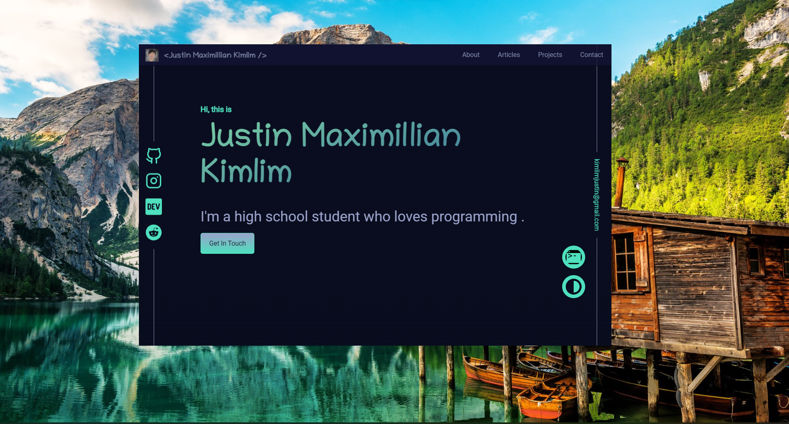

<div align="center">


<p align="center"><span><b>Wiz</b>, A simple, frameless, lightweight browser for screenshots.</span></p>

[](https://github.com/kimlimjustin/wiz/releases) [](https://github.com/kimlimjustin/wiz/releases) [](https://github.com/kimlimjustin/wiz/releases) [](https://github.com/kimlimjustin/wiz/releases)
</div>


## Intallation
You can find the suitable installer for your system in the [releases](https://github.com/kimlimjustin/wiz/releases) page.
## Why Wiz?

Screenshoting a website for demo perpose has been developer's common task and it's sometime quite annoying to cut the image screenshoted from the frame of a browser and that's why I created this simple browser.

Wiz is built using [`tauri`](https://tauri.studio) framework and it's a cross-platform application. Also, unlike apps built on the top of Electron, it is lightweight! In addition, it's completely free.

## How to use?
You can start Wiz by running it via terminal. CLI Usage:

```bash
wiz [url to open]
```
example:
```bash
wiz google.com
```

### Dragging Wiz
There is a little trick to drag Wiz. There is a hidden dragging area in the top left corner of the window. Just drag the window to the area and it will be dragged around the screen.


### Closing Wiz
You can close Wiz by killing it by press the `Esc` button.
